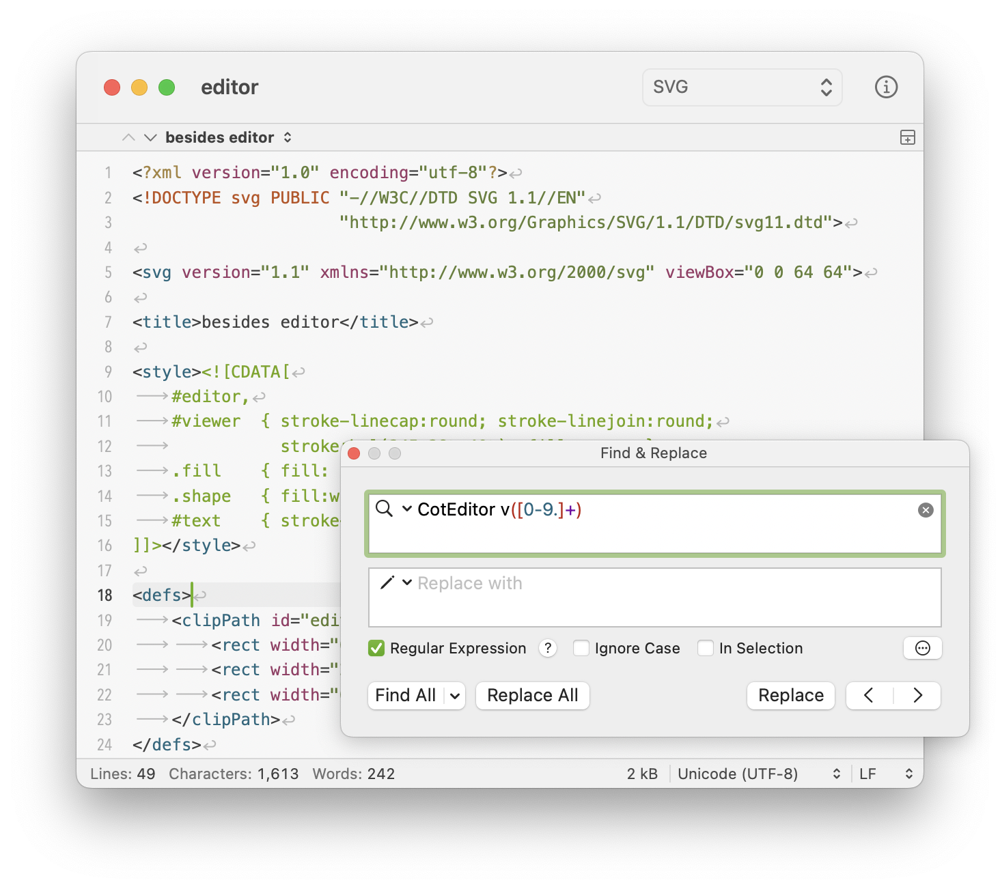

CotEditor
=============================

CotEditor is a lightweight plain-text editor for macOS.

- __Requirement__: macOS 10.12.2 Sierra or later
- __Web Site__: <https://coteditor.com>
- __Mac App Store__: <https://itunes.apple.com/app/coteditor/id1024640650?ls=1>

Source Code
-----------------------------

CotEditor is a pure document-based Cocoa application written in Swift.

### Development Environment

- macOS 10.14 Mojave
- Xcode 10.1
- Swift 4.2
- Sandbox enabled

How to Build
-----------------------------

1. `git submodule update --init`
2. Update frameworks (you can skip this process if you only wanna build).
    1. `carthage update --platform macOS`
    2. Build Sparkle's XPCs by running "Sparkle XPCs" scheme in CotEditor.xcworkspace
3. Open CotEditor.xcworkspace in Xcode.
4. Build.

License
-----------------------------

© 2005-2009 nakamuxu,
© 2011, 2014 usami-k,
© 2013-2019 1024jp.

The source code is distributed under the terms of the __Apache License, Version 2.0__. See [LICENSE](LICENSE) for details.
