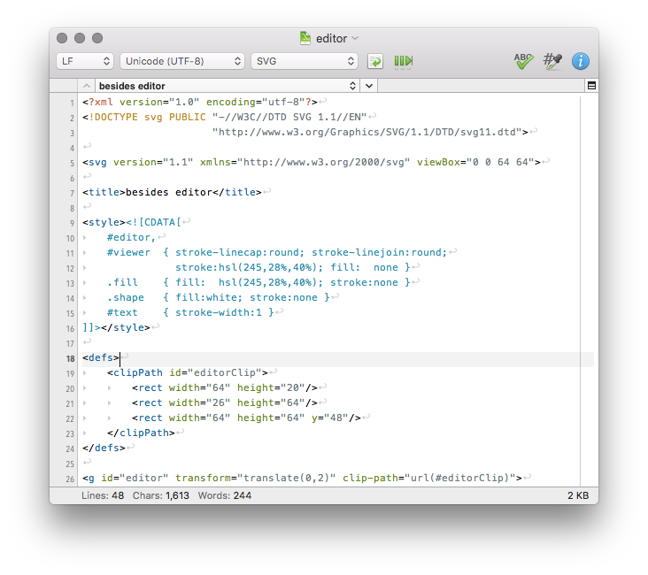

CotEditor
=============================

CotEditor is a lightweight plain-text editor for OS X.

__Requirement__: OS X Mountain Lion or higher

__Distribution Site__ : <http://coteditor.com>

About Source Code
-----------------------------

The source code is written in Cocoa and Objective-C with ARC enabled.

### Development Environment
- OS X Yosemite
- Xcode 6.3

How to Build
-----------------------------
0. Install [CocoaPods](http://cocoapods.org) if you don't have it.
1. Move to the project root directory and run `pod install` on your terminal.
2. Open CotEditor.xcworkspace on Xcode.
3. build.

License
-----------------------------
© 2005-2009 nakamuxu,
© 2011, 2014 usami-k,
© 2014-2015 1024jp.
All rights reserved.

The source code is distributed under the terms of the GNU General Public License. See the bundled [LICENSE](LICENSE) for details.
